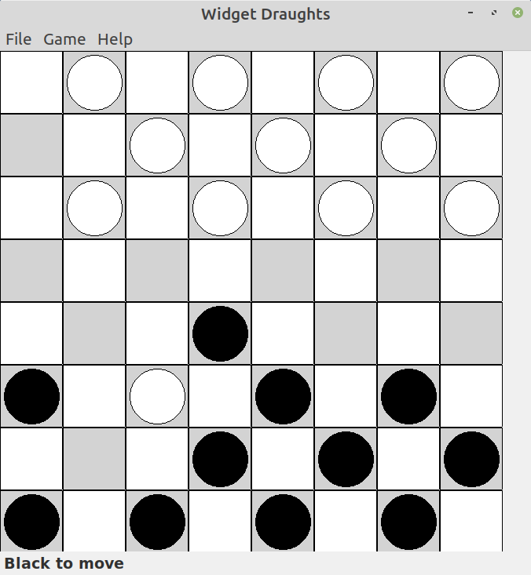

# Widget Draughts

Widget Draughts is a computer draughts game for Linux written using C++ and wxWidgets.



## Getting Started

Draughts (also known as checkers) is a  strategy board game for two players which involves moving pieces diagonally on an 8×8 (64 cell) checkerboard. Each player has their own colour and begins the game with 12 pieces which can only move and capture in a diagonally forwards direction. If an opponents piece is in the next square, the player can jump over it and capture it, removing the piece from the board. If a player can jump, it must and if after making a jump another jump is possible it must jump again. To win the game you must stop the opponent (computer) from moving when it comes to their turn which can be done by taking all of their pieces or by blocking their pieces so that there is nowhere to move. A piece which reaches the other end of the board is "crowned" a king. Kings are allowed to move and capture diagonally forwards and backwards and so are more powerful and valuable than ordinary pieces. For more information follow this [link](https://en.wikipedia.org/wiki/Draughts).

With Widget Draughts you play against the computer. The human player is white and the computer is black.


## Install Using Deb Package

You can use the deb package [wxdraughts_1.0.3_amd64.deb](https://github.com/crispinalan/widget-draughts/tree/master/deb/) for installing the latest version of widget draughts. Right click on the package and use "Save Link As".

### Linux Mint Debian Edition (Debbie)

Download the wxdraughts_1.0.3_amd64.deb package into the Downloads directory.

Open the wxdraughts_1.0.3_amd64.deb with gdebi and install entering your password when prompted.

### Debian

Download wxdraughts_1.0.3_amd64.deb package into the Downloads directory.

Then install using the command line as follows (don't forget the "-" with su)

```
user@debian:su -
Password: 
root@debian:~# cd /home/user/Downloads/
root@debian:/home/user/Downloads# dpkg -i wxdraughts_1.0.3_amd64.deb
```

### Build From Source

To build Widget Draughts from source 

```
mkdir build  
cd build  
cmake ..
make
sudo make install (Mint)
```
Widget Draughts (wxdraughts) is installed to /usr/local/bin

## Build From Source Prerequisites

To build and install Widget Draughts on Debian, Ubuntu and Ubuntu derivatives you need to install the following packages (if not already installed) 

```
sudo apt install build-essential
sudo apt install cmake
sudo apt install libwxgtk3.0-dev
sudo apt install git 
```

## Versioning

[SemVer](http://semver.org/) is used for versioning. The version number has the form 0.0.0 representing major, minor and bug fix changes. Currently at 1.0.3.

## Authors

* **Alan Crispin** [(crispina)](https://github.com/crispinalan)


## License

This project is licensed under the Apache 2.0 License.

[Apache 2.0 License](https://www.apache.org/licenses/LICENSE-2.0)

## Roadmap

Future updates:
```
check for blocking wins
strengthen draughts-play minimax engine
check pieces threatened with capture 
check pieces endangered when making a move
introduce triple kings 
improve end game 
provide additional options
``` 


